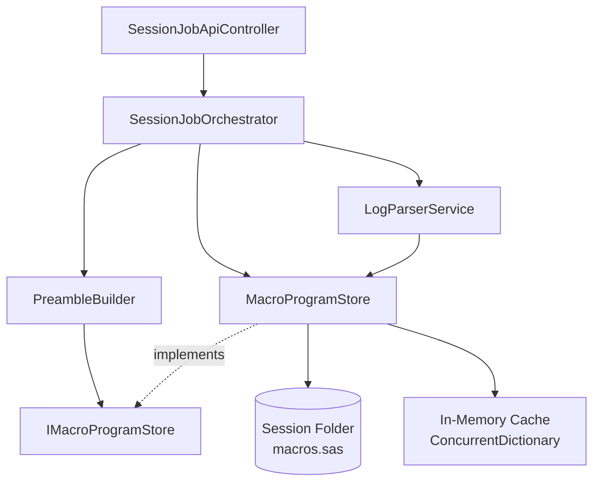

# Design Document: Macro Program Persistence

## Overview

This feature implements session-based macro program persistence for the SAS Job Runner application, completing the session continuity triad alongside macro variables and WORK datasets. The design extends the proven architecture pattern established by `MacroVarStore` to handle SAS macro program definitions.

### Business Context

SAS macro programs (defined via `%macro/%mend` statements) are a fundamental building block for SAS development, enabling code reuse and parameterization. Currently, these definitions are lost after each job completes, forcing users to redefine macros in every submission. This breaks the illusion of continuous session behavior that the application aims to provide.

By persisting macro programs to disk and reloading them via preamble injection, users can define macros once and use them across multiple job submissions, creating a seamless development experience.

### Technical Approach

The implementation follows three core phases:

1. **Extraction**: After each job completes, inject catalog-listing code to enumerate and extract macro source from the SAS `WORK.SASMACR` catalog
2. **Persistence**: Parse extracted macro source from logs, validate syntax, and write to `macros.sas` file in the session folder
3. **Restoration**: On job submission, read `macros.sas` and inject macro definitions into preamble code before user code executes

This design mirrors the macro variable persistence pattern: lazy loading from disk, in-memory caching for performance, atomic file writes for concurrency safety, and graceful degradation when file I/O fails.

### Design Goals

- **Consistency**: Follow the exact architectural patterns established by `MacroVarStore` (interfaces, dependency injection, file structure, error handling)
- **Reliability**: Validate macro syntax before persistence to prevent corrupted definitions from breaking subsequent jobs
- **Performance**: Use in-memory caching to avoid disk I/O on every job submission
- **Safety**: Handle concurrent access without corruption using file locks and atomic writes
- **Observability**: Provide structured logging for debugging session persistence issues

---

## Architecture

### Component Diagram



### Data Flow

#### Job Submission Flow (Read Path)

1. User submits SAS code via API
2. `SessionJobOrchestrator.SubmitAsync` calls `MacroProgramStore.GetAsync(sessionId)`
3. `MacroProgramStore` checks in-memory cache
   - **Cache hit**: Return cached source immediately
   - **Cache miss**: Load from `macros.sas`, populate cache, return
4. `PreambleBuilder` injects macro source into preamble after library definitions
5. Complete code (preamble + macros + user code) submitted to SAS

#### Job Completion Flow (Write Path)

1. Job reaches terminal state (CompletedSuccess, CompletedError, Failed)
2. `SessionJobOrchestrator.StreamAndFinalizeAsync` retrieves full job log
3. `LogParserService.ParseMacroCatalog` extracts macro definitions from log markers
4. `MacroProgramStore.SetAsync(sessionId, macros)` called with parsed macros
5. In-memory cache updated immediately (synchronous)
6. File write operation queued as fire-and-forget background task
7. Background task writes atomically to `macros.sas` using temp file + rename pattern

### Architectural Patterns

| Pattern | Application |
|---------|-------------|
| **Lazy Loading** | Macros loaded from disk only when cache is empty |
| **Cache-Aside** | In-memory cache checked first, disk as fallback |
| **Fire-and-Forget** | File writes don't block API responses |
| **Atomic Write** | Write to temp file, then rename to prevent corruption |
| **Template Method** | Same interface and registration pattern as MacroVarStore |
| **Fail-Safe** | Continue with in-memory state when file I/O fails |

---

## Components and Interfaces

### IMacroProgramStore Interface

```csharp
namespace SasJobRunner.Services;

public interface IMacroProgramStore
{
    /// <summary>
    /// Retrieves all macro program source code for a session.
    /// Returns cached source if available, otherwise loads from disk.
    /// </summary>
    /// <param name="sessionId">The session identifier</param>
    /// <returns>Complete macro source code (all macros concatenated), or empty string if none exist</returns>
    Task<string> GetAsync(string sessionId);

    /// <summary>
    /// Updates all macro program definitions for a session.
    /// Updates in-memory cache immediately and queues background file write.
    /// </summary>
    /// <param name="sessionId">The session identifier</param>
    /// <param name="macros">Dictionary mapping macro names to source code</param>
    Task SetAsync(string sessionId, IReadOnlyDictionary<string, string> macros);
}
```

### MacroProgramStore Implementation

**Dependencies:**
- `IConfiguration`: Access to `SessionStorage:StudyFolder` configuration
- `ILogger<MacroProgramStore>`: Structured logging

**Internal State:**
- `_cache: ConcurrentDictionary<string, string>` — Maps sessionId → complete macro source
- `_loadedFromDisk: ConcurrentDictionary<string, bool>` — Tracks sessions loaded to prevent repeated reads
- `_fileLocks: ConcurrentDictionary<string, SemaphoreSlim>` — Per-session locks for file operations
- `_sessionToUser: ConcurrentDictionary<string, string>` — Maps sessionId → userId for path construction
- `_studyFolder: string?` — Base path from configuration

**Key Methods:**

```csharp
// Public API
Task<string> GetAsync(string sessionId);
Task SetAsync(string sessionId, IReadOnlyDictionary<string, string> macros);

// Internal registration (called by SessionJobOrchestrator)
void RegisterSession(string sessionId, string userId);

// Private implementation
Task<string> LoadFromFileAsync(string sessionId);
Task WriteToFileAsync(string sessionId, string userId, string macroSource);
string? TryResolveUserId(string sessionId);
string GetMacrosFilePath(string sessionId, string userId);
string FormatMacroSource(IReadOnlyDictionary<string, string> macros);
bool ValidateMacroSyntax(string macroName, string macroSource, out string? error);
```

### LogParserService Extensions

**New Method:**

```csharp
/// <summary>
/// Parses macro catalog extraction output from job log.
/// Looks for macro extraction markers and reconstructs macro source code.
/// </summary>
/// <param name="logLines">Complete job log</param>
/// <returns>Dictionary mapping macro names to source code</returns>
public Dictionary<string, string> ParseMacroCatalog(IEnumerable<string> logLines);
```

**Extraction Approach:**

The parser injects catalog extraction code into the job postamble (after `%put _user_;`):

```sas
/* === MACRO CATALOG EXTRACTION START === */
proc catalog catalog=work.sasmacr;
   contents;
quit;

%macro _extract_macros;
   %local _i _name;
   proc sql noprint;
      select objname into :_name separated by '|'
      from dictionary.catalogs
      where libname='WORK' and memname='SASMACR' and objtype='MACRO';
   quit;
   
   %let _i = 1;
   %let _name = %scan(&_name, &_i, '|');
   %do %while("&_name" ne "");
      %if %substr(&_name, 1, 4) ne SYS_ %then %do;
         %put === MACRO_SOURCE_START: &_name ===;
         %copy &_name / source;
         %put === MACRO_SOURCE_END: &_name ===;
      %end;
      %let _i = %eval(&_i + 1);
      %let _name = %scan(&_name, &_i, '|');
   %end;
%mend _extract_macros;

%_extract_macros;
/* === MACRO CATALOG EXTRACTION END === */
```

The parser then scans for `=== MACRO_SOURCE_START: <name> ===` and `=== MACRO_SOURCE_END: <name> ===` markers to extract each macro's source.

### PreambleBuilder Extensions

**Updated Build Method Signature:**

```csharp
public string Build(
    string userId,
    string sessionId,
    IReadOnlyDictionary<string, string> macroVars,
    string macroPrograms)  // NEW PARAMETER
```

**Preamble Structure:**

```sas
/* === SESSION LIBRARY DEFINITION === */
LIBNAME SESSLIB "{studyFolder}/sessions/{userId}/{sessionId}/";

/* === MACRO PROGRAM RESTORATION === */
{macroPrograms}

/* === MACRO VARIABLE RESTORATION === */
%let SESSIONID = {sessionId};
%let MYVAR = {value};
...
```

Macro programs are injected **after** library definition but **before** macro variables. This ensures:
1. Libraries are available if macros reference them
2. Macros are defined before variable restoration (in case variable values reference macros)
3. Macros are available for user code execution

---

## Data Models

### Macro Program File Format

**File Path:** `{StudyFolder}/sessions/{userId}/{sessionId}/macros.sas`

**File Structure:**

```sas
/*
 * Auto-generated macro program storage for session {sessionId}
 * User: {userId}
 * Last Updated: {ISO8601 timestamp}
 * 
 * DO NOT EDIT MANUALLY - This file is automatically maintained by SAS Job Runner
 */

%macro greet(name);
   %put Hello, &name!;
%mend greet;

%macro calculate(a, b, op);
   %local result;
   %if &op = add %then %let result = %eval(&a + &b);
   %else %if &op = subtract %then %let result = %eval(&a - &b);
   %put Result: &result;
%mend calculate;
```

**Format Requirements:**
- Valid SAS source code that can be executed directly
- One blank line between macro definitions
- Header comment with metadata
- Macros sorted alphabetically by name for deterministic output
- Preserves original macro formatting (indentation, comments, line breaks)

### In-Memory Cache Model

```csharp
// Key: sessionId
// Value: Complete macro source code (all macros concatenated)
private readonly ConcurrentDictionary<string, string> _cache;

// Key: sessionId
// Value: true if disk load has been attempted (prevents repeated failed reads)
private readonly ConcurrentDictionary<string, bool> _loadedFromDisk;

// Key: sessionId
// Value: userId (for path construction)
private readonly ConcurrentDictionary<string, string> _sessionToUser;

// Key: sessionId
// Value: SemaphoreSlim for file operation locking
private readonly ConcurrentDictionary<string, SemaphoreSlim> _fileLocks;
```

### Macro Syntax Validation Rules

Before persisting, each macro is validated:

1. **Name Validation**: Macro name must match `^[A-Z_][A-Z0-9_]*$` (case-insensitive)
2. **Balance Validation**: Source must contain matching `%macro <name>` and `%mend <name>;` statements
3. **System Macro Filter**: Macros starting with `SYS_` or `_SYS` are ignored
4. **Quote Balance**: Open quotes must have matching close quotes
5. **Parenthesis Balance**: Open parentheses must have matching close parentheses

Invalid macros are logged with warnings but do not prevent persistence of valid macros.

---

## Correctness Properties

*A property is a characteristic or behavior that should hold true across all valid executions of a system—essentially, a formal statement about what the system should do. Properties serve as the bridge between human-readable specifications and machine-verifiable correctness guarantees.*

### PBT Applicability Assessment

This feature is suitable for property-based testing in specific areas: macro syntax validation, formatting logic, filtering behavior, and parsing operations. These are pure functions with clear input/output relationships where universal properties can be verified across many generated inputs.

**PBT IS appropriate for:**
- Validation logic (macro name format, syntax balance, delimiter matching)
- Formatting and serialization (macro source formatting, alphabetical ordering)
- Filtering behavior (system macro exclusion, invalid macro filtering)
- Data structure operations (update isolation, deduplication)

**PBT is NOT appropriate for:**
- File I/O operations (disk reads/writes, atomic file operations)
- SAS catalog integration (PROC CATALOG, %COPY extraction)
- Caching behavior (ConcurrentDictionary operations)
- Orchestrator workflow (component integration, async operations)

Infrastructure concerns (file I/O, SAS integration, caching, concurrency) will use integration and example-based tests.

### Property 1: System Macro Filtering

*For any* macro name, if the name starts with `SYS_` (case-insensitive), then the macro SHALL be excluded from the parsed macro dictionary returned by LogParserService.

**Validates: Requirements 1.7**

**Rationale:** System macros are internal to SAS and should never be persisted. This property ensures the filter correctly identifies system macros regardless of case variation or what follows the SYS_ prefix.

---

### Property 2: Macro Extraction Accuracy

*For any* log content containing macro definition markers, the parser SHALL extract all macro names and their complete source code such that each extracted (name, source) pair matches the original macro definition.

**Validates: Requirements 1.2, 1.8**

**Rationale:** Extraction must accurately capture macro names and source code across all complexity levels (parameters, local variables, nested calls). This property verifies extraction correctness regardless of macro structure.

---

### Property 3: Comprehensive Macro Formatting

*For any* non-empty dictionary of macro programs, the formatted source code SHALL: (1) contain exactly N macro definitions where N is the dictionary size, (2) separate each macro with blank lines, (3) maintain consistent indentation, and (4) preserve each macro as a complete `%macro`...`%mend` block.

**Validates: Requirements 2.2, 14.1**

**Rationale:** Formatting must preserve each macro as a distinct, executable block with consistent structure. This comprehensive property verifies structural integrity, separation, and formatting consistency in a single unified test.

---

### Property 4: Alphabetical Macro Ordering

*For any* dictionary of macro programs, the formatted source code SHALL list macros in case-insensitive alphabetical order by macro name.

**Validates: Requirements 2.6**

**Rationale:** Deterministic ordering enables diff-based version control and predictable file content. Alphabetical sorting must hold regardless of input order or macro name variations.

---

### Property 5: Preamble Section Ordering

*For any* preamble built with macro programs and macro variables, the macro program section SHALL appear after the library definition section AND before the macro variable restoration section.

**Validates: Requirements 4.2**

**Rationale:** This ordering ensures libraries are available for macro definitions, and macros are defined before variables (in case variables reference macros). The ordering must hold for any combination of macros and variables.

---

### Property 6: Macro Name Validation

*For any* string used as a macro name, the validation SHALL accept the name if and only if it matches the pattern `^[A-Z_][A-Z0-9_]*$` (case-insensitive) and does not start with `SYS_`.

**Validates: Requirements 10.2, 1.7**

**Rationale:** SAS identifier rules must be enforced universally. This property verifies validation accepts all valid identifiers and rejects all invalid ones across the input space.

---

### Property 7: Macro Statement Balance Validation

*For any* macro source string, the validation SHALL accept the source if and only if it contains exactly one `%macro <name>` statement and exactly one matching `%mend <name>;` statement, where the name matches.

**Validates: Requirements 10.1**

**Rationale:** Unbalanced macro/mend statements produce invalid SAS code. This property ensures validation correctly identifies balanced pairs across varying macro structures.

---

### Property 8: Quote and Parenthesis Balance Validation

*For any* macro source string, the validation SHALL reject the source if it contains unbalanced quotes (', ", or `) or unbalanced parentheses ( ), considering SAS string escaping rules.

**Validates: Requirements 10.3**

**Rationale:** Unbalanced delimiters break SAS parsing. This property verifies validation catches balance errors regardless of macro complexity or nesting depth.

---

### Property 9: Invalid Macro Filtering

*For any* dictionary of macro programs containing both valid and invalid macros, the formatted output SHALL contain only macros that pass all validation checks, preserving all valid macros.

**Validates: Requirements 10.5**

**Rationale:** Invalid macros must not corrupt the macros.sas file, but valid macros should persist successfully. This property tests fail-safe filtering behavior.

---

### Property 10: Round-Trip Preservation

*For any* dictionary of valid macro programs, the sequence of operations (format → write to file → read from file) SHALL produce a macro source string that, when executed by SAS, is functionally equivalent to the original macro definitions.

**Validates: Requirements 14.2, 14.3, 14.4, 14.5**

**Rationale:** Macro persistence must preserve executable semantics. This comprehensive round-trip property verifies that formatting, writing, and reading preserve macro behavior including parameters, local variables, comments, and body logic. Note: "Functionally equivalent" means the macro produces the same output when called with the same inputs, even if whitespace varies. This property subsumes individual checks for preservation of structure, comments, and parsing fidelity.

---

### Property 11: Macro Update Deduplication

*For any* sequence of macro updates where a macro is redefined multiple times, the persisted Macros_File SHALL contain only the most recent definition of each macro, with no duplicate entries.

**Validates: Requirements 15.2, 15.3**

**Rationale:** Deduplication ensures file integrity and prevents macro definition conflicts. This property verifies that only the latest version of each macro persists, regardless of update frequency or ordering.

---

### Property 12: Single Macro Update Isolation

*For any* existing macro dictionary and any single macro update, after SetAsync with the updated macro, all macros except the updated one SHALL remain unchanged in the in-memory cache.

**Validates: Requirements 15.5**

**Rationale:** Updating one macro must not affect others. This property verifies isolation of updates across arbitrary macro sets and update operations.

---

## Error Handling

### Error Classification and Recovery

| Error Category | Examples | Handling Strategy | Recovery Behavior |
|----------------|----------|-------------------|-------------------|
| **Configuration Errors** | Missing `SessionStorage:StudyFolder` | Log error at startup, operate in memory-only mode | Continue with in-memory cache, disable file persistence |
| **File System Errors** | Disk full, permissions denied, I/O errors | Log warning with context, continue with cache | File operations fail gracefully, cache remains authoritative |
| **Parse Errors** | Malformed log output, missing markers | Log warning with context, return empty result | Skip corrupted entries, process remaining valid entries |
| **Validation Errors** | Invalid macro syntax, unbalanced delimiters | Log warning with macro name and reason | Exclude invalid macro, persist remaining valid macros |
| **Concurrency Errors** | File lock timeout, race conditions | Retry with exponential backoff, then log warning | Latest write wins, in-memory cache remains consistent |

### Fail-Safe Principles

1. **In-Memory Cache as Truth**: Cache is always updated immediately (synchronous). File persistence failures never block API responses or corrupt cache state.

2. **Graceful Degradation**: If file operations fail repeatedly, the system continues functioning with in-memory state until file system issues are resolved.

3. **Partial Success**: When processing multiple macros, validation or parse errors for one macro do not prevent processing of other macros.

4. **Idempotent Operations**: Repeated calls to `SetAsync` with the same data produce the same result, making retry safe.

5. **Observable Failures**: All errors are logged with structured context (sessionId, userId, filePath, operation, error details) to enable troubleshooting.

### Error Logging Standards

Following the MacroVarStore pattern:

- **Information**: Successful file operations (write complete, load complete) with counts
- **Debug**: Normal workflow events (cache hit, cache miss, new session)
- **Warning**: Recoverable errors (file I/O failure, parse error, validation failure) with full context
- **Error**: Configuration errors that prevent normal operation

Example:
```csharp
_logger.LogWarning(ex,
    "Failed to write macros file for session {SessionId} (user {UserId}) at {FilePath}: {Message}. Operation continues with in-memory cache.",
    sessionId, userId, filePath, ex.Message);
```

---

## Testing Strategy

### Testing Approach Overview

This feature requires a dual testing approach combining property-based tests for pure logic and integration/example-based tests for infrastructure concerns:

| Test Type | Coverage Area | Rationale |
|-----------|---------------|-----------|
| **Property-Based Tests** | Validation logic, formatting, filtering, ordering | Pure functions with universal properties across large input spaces |
| **Example-Based Unit Tests** | Error handling, cache behavior, conditional logic | Concrete scenarios with specific inputs/outputs |
| **Integration Tests** | File I/O, SAS catalog extraction, orchestrator workflow | External system interactions and end-to-end flows |

### Property-Based Test Specifications

**Framework:** Use [fast-check](https://github.com/dubzzz/fast-check) for JavaScript/TypeScript or [FsCheck](https://github.com/fscheck/FsCheck) for C#/.NET

**Configuration:** Minimum 100 iterations per property test (due to randomization)

**Test Tagging:** Each property test must reference its design document property using this format:
```csharp
// Feature: macro-program-persistence, Property 1: System Macro Filtering
```

#### PBT Test Suite

**Test 1: System Macro Filtering** (Property 1)
- **Generator**: Arbitrary macro names (valid SAS identifiers)
- **Variant 1**: Names starting with `SYS_`, `sys_`, `Sys_` (should be filtered)
- **Variant 2**: Names not starting with `SYS_` (should pass)
- **Assertion**: Filtered results contain zero system macros
- **Tag**: `Feature: macro-program-persistence, Property 1: System Macro Filtering`

**Test 2: Macro Extraction Accuracy** (Property 2)
- **Generator**: Log content with randomly generated macro definitions at various positions
- **Variant 1**: Simple macros with no parameters
- **Variant 2**: Complex macros with parameters, local variables, nested calls
- **Assertion**: For each macro in input log, extracted (name, source) pair matches original definition exactly
- **Tag**: `Feature: macro-program-persistence, Property 2: Macro Extraction Accuracy`

**Test 3: Comprehensive Macro Formatting** (Property 3)
- **Generator**: Arbitrary dictionary of macro name → source code (1-20 macros)
- **Assertion**: 
  - Formatted output contains exactly N `%macro` statements
  - Formatted output contains exactly N `%mend` statements
  - Macros separated by blank lines
  - Consistent indentation maintained throughout
  - Each macro is a complete executable block
- **Tag**: `Feature: macro-program-persistence, Property 3: Comprehensive Macro Formatting`

**Test 4: Alphabetical Macro Ordering** (Property 4)
- **Generator**: Arbitrary dictionary of macro programs (varying input order)
- **Assertion**: Parsed macro names from formatted output are in case-insensitive alphabetical order
- **Tag**: `Feature: macro-program-persistence, Property 4: Alphabetical Macro Ordering`

**Test 5: Preamble Section Ordering** (Property 5)
- **Generator**: Arbitrary macro source strings and variable dictionaries
- **Assertion**: 
  - Index of library definition < Index of macro section < Index of variable section
  - Verified using string index positions of section markers
- **Tag**: `Feature: macro-program-persistence, Property 5: Preamble Section Ordering`

**Test 6: Macro Name Validation** (Property 6)
- **Generator**: 
  - Valid names: `[A-Z_][A-Z0-9_]*` pattern (not starting with SYS_)
  - Invalid names: starting with digit, containing special chars, empty string, SYS_ prefix
- **Assertion**: Validation accepts all valid names, rejects all invalid names
- **Tag**: `Feature: macro-program-persistence, Property 6: Macro Name Validation`

**Test 7: Macro Statement Balance Validation** (Property 7)
- **Generator**:
  - Balanced: `%macro <name>; <body> %mend <name>;`
  - Unbalanced: missing %mend, mismatched names, duplicate %macro
- **Assertion**: Validation accepts only balanced pairs with matching names
- **Tag**: `Feature: macro-program-persistence, Property 7: Macro Statement Balance Validation`

**Test 8: Quote and Parenthesis Balance Validation** (Property 8)
- **Generator**:
  - Balanced: matched quotes and parens
  - Unbalanced: open quote without close, open paren without close
- **Assertion**: Validation rejects all unbalanced source strings
- **Tag**: `Feature: macro-program-persistence, Property 8: Quote and Parenthesis Balance Validation`

**Test 9: Invalid Macro Filtering** (Property 9)
- **Generator**: Dictionary mixing valid and invalid macros (50/50 split)
- **Assertion**: 
  - Formatted output contains only valid macros
  - All valid macros from input appear in output
  - Zero invalid macros in output
- **Tag**: `Feature: macro-program-persistence, Property 9: Invalid Macro Filtering`

**Test 10: Round-Trip Preservation** (Property 10)
- **Generator**: Dictionary of valid macro programs with varying complexity (parameters, locals, comments, body logic)
- **Assertion**: 
  - Format → Write → Read produces source code that is functionally equivalent to original
  - All macro parameters preserved
  - All local variables preserved
  - All comments preserved
  - Macro body logic preserved (structural/AST equivalence)
- **Note**: Full functional equivalence requires SAS execution sandbox. Implementation will use structural preservation (AST comparison) as proxy for functional equivalence.
- **Tag**: `Feature: macro-program-persistence, Property 10: Round-Trip Preservation`

**Test 11: Macro Update Deduplication** (Property 11)
- **Generator**: 
  - Sequence of macro dictionaries with repeated macro names (simulating updates)
  - Each update changes the source for the same macro name
- **Assertion**: 
  - Final persisted file contains exactly one definition per unique macro name
  - Each macro definition is the most recent version from the update sequence
  - Zero duplicate entries in output
- **Tag**: `Feature: macro-program-persistence, Property 11: Macro Update Deduplication`

**Test 12: Single Macro Update Isolation** (Property 12)
- **Generator**: 
  - Initial macro dictionary (5-10 macros)
  - Random macro name from dictionary
  - New source for that macro
- **Assertion**: After update, all macros except the updated one have identical source to initial state
- **Tag**: `Feature: macro-program-persistence, Property 12: Single Macro Update Isolation`

### Example-Based Unit Tests

These tests cover specific scenarios, error conditions, and concrete behaviors:

1. **Cache Behavior Tests**
   - Cache hit returns immediately without disk access
   - Cache miss triggers disk load and populates cache
   - Repeated GetAsync after load returns same result

2. **Error Handling Tests**
   - Missing StudyFolder configuration: operates in memory-only mode
   - File write failure: logs warning, cache remains updated
   - File read failure: logs warning, returns empty string
   - Parse failure: logs warning, returns empty dictionary

3. **Conditional Logic Tests**
   - Empty macro dictionary: omit macro section from preamble
   - Missing macros.sas file: return empty string without error
   - Session folder missing: create directory structure on write

4. **Logging Tests**
   - Successful write: log info with macro count
   - Validation failure: log warning with macro name and reason
   - New session: log debug on first access

### Integration Tests

These tests verify end-to-end workflows with real file system and component integration:

1. **Full Job Workflow Test**
   - Submit job with macro definition
   - Verify macros.sas created in session folder
   - Submit second job using the macro
   - Verify macro executes successfully

2. **SAS Catalog Extraction Test**
   - Create test job defining 2-3 macros
   - Run job and capture log
   - Verify extraction code finds all macros
   - Verify source extracted correctly

3. **Concurrent Access Test**
   - Submit multiple jobs for same session simultaneously
   - Verify macros.sas not corrupted
   - Verify all macros persist correctly

4. **Session Isolation Test**
   - Submit jobs to different sessions with same macro names
   - Verify each session's macros.sas contains only its macros
   - Verify no cross-session contamination

### Test Coverage Goals

- **Line Coverage**: >90% for MacroProgramStore and LogParserService macro methods
- **Branch Coverage**: >85% for validation and error handling paths
- **Property Coverage**: 100% (all 12 properties implemented as tests)
- **Integration Coverage**: All critical paths (submit → extract → persist → load → inject)

---

## Security Considerations

### Path Traversal Protection

**Risk:** Malicious sessionId or userId values containing `..` or absolute paths could escape session folder boundaries.

**Mitigation:**
- Validate sessionId and userId formats (alphanumeric + hyphen only)
- Use `Path.GetFullPath` and verify result starts with expected session root
- Log and reject any path that escapes session folder

### Code Injection via Macro Source

**Risk:** Malicious macro source could contain SAS code that accesses files outside session folder or executes system commands.

**Mitigation:**
- SAS already runs in sandbox environment with limited permissions
- SESSLIB library restricts file access to session folder
- Macro source validation catches syntax errors but cannot prevent malicious logic
- **Document limitation**: Users with session access can execute arbitrary SAS code (by design)

### File System Permissions

**Risk:** Incorrect permissions on session folders or macros.sas could leak data between users.

**Mitigation:**
- Session folders use `{userId}` path component for OS-level isolation
- Application runs with service account that has access to all session folders
- OS-level permissions should restrict user-to-user access
- **Recommendation**: Session folders should be readable only by service account and owning user

### Log Content Exposure

**Risk:** SAS logs may contain sensitive data that gets parsed and stored in application logs.

**Mitigation:**
- Application logs should have appropriate retention and access controls
- Macro source typically doesn't contain sensitive data (logic only)
- If users embed sensitive values in macro definitions, they persist in macros.sas
- **Document limitation**: Macro persistence is not appropriate for secrets

---

## Performance Considerations

### Caching Strategy Impact

| Operation | Without Cache | With Cache | Improvement |
|-----------|---------------|------------|-------------|
| GetAsync (cache hit) | ~5-20ms (disk read) | ~0.1ms (dictionary lookup) | 50-200x faster |
| GetAsync (cache miss) | ~5-20ms (first load) | ~5-20ms (same) | No penalty |
| SetAsync | ~5-20ms (file write blocks) | ~0.1ms + background write | 50-200x faster perceived |

**Observation:** In-memory caching is critical for job submission latency. Disk I/O would add unacceptable delay to preamble construction.

### File Size Projections

**Typical Macro Size:** 50-500 lines (1-10 KB)
**Expected Macro Count per Session:** 5-20 macros
**Projected File Size:** 5-200 KB per session

**Scaling Analysis:**
- 1,000 active sessions × 50 KB average = 50 MB total storage
- 10,000 active sessions × 50 KB average = 500 MB total storage
- **Conclusion:** File storage overhead is negligible compared to dataset storage

### Parsing Performance

**Log Parsing Cost:**
- Log size: 10-100 KB typical, 1-10 MB for large jobs
- Macro extraction regex: O(n) where n = log size
- Expected overhead: <100ms per job completion

**Optimization:** Use compiled regex and limit parsing to marked sections (between extraction markers)

### Concurrency Bottlenecks

**File Lock Contention:**
- Each session has independent file lock (no cross-session blocking)
- Fire-and-forget writes minimize lock hold time
- Worst case: 2-3 concurrent writes for same session (rare)

**Cache Contention:**
- ConcurrentDictionary handles read concurrency without locking
- Write contention only on same sessionId (rare in practice)

**Conclusion:** Concurrency design scales well for expected usage patterns.

---

## Deployment Considerations

### Backward Compatibility

**Existing Sessions:** Sessions created before this feature will have no `macros.sas` file. The system handles this gracefully:
- GetAsync returns empty string when file doesn't exist
- First job defining macros creates the file
- No migration needed

**Configuration:** New `SessionStorage:StudyFolder` configuration required. If missing:
- Log error at startup
- Operate in memory-only mode (no persistence)
- Existing functionality (variables, datasets) continues working

### Rollout Strategy

**Phase 1: Dark Launch**
- Deploy code with feature flag disabled
- Monitor logs for any initialization errors
- Validate configuration in production environment

**Phase 2: Canary Deployment**
- Enable for 10% of users
- Monitor file system metrics (disk usage, I/O latency)
- Validate no performance regressions

**Phase 3: Full Rollout**
- Enable for all users
- Announce feature in release notes
- Monitor support requests for user confusion

### Monitoring and Observability

**Key Metrics:**
- `macro_store_read_success_total` - Successful file reads
- `macro_store_read_failure_total` - Failed file reads (by error type)
- `macro_store_write_success_total` - Successful file writes
- `macro_store_write_failure_total` - Failed file writes (by error type)
- `macro_store_cache_hit_ratio` - Cache hit rate
- `macro_extraction_success_total` - Successful macro extractions from logs
- `macro_validation_failure_total` - Validation failures (by validation rule)

**Alerting:**
- Alert if write failure rate >5% for 10 minutes (disk issue)
- Alert if read failure rate >10% for 10 minutes (permission issue)
- Alert if cache hit ratio <80% (possible cache eviction problem)

**Logging:**
- All file operations logged with structured context
- All validation failures logged with macro name and reason
- Startup configuration logged (StudyFolder path, mode)

---

## Open Questions and Future Enhancements

### Open Questions

None identified. All requirements are clear and design decisions documented.

### Future Enhancement Opportunities

1. **Macro Versioning**
   - Track macro definition history (v1, v2, v3)
   - Allow rollback to previous macro version
   - Show macro change diff in UI

2. **Macro Search and Discovery**
   - List all macros defined in a session
   - Search macros by name or content
   - Show macro parameter signatures and documentation

3. **Cross-Session Macro Sharing**
   - Define "library" macros shared across user's sessions
   - Import macros from other users (with permissions)
   - Macro marketplace or catalog

4. **Macro Execution Analytics**
   - Track macro invocation frequency
   - Identify unused macros
   - Suggest macro cleanup

5. **IDE Integration**
   - Syntax highlighting for macro definitions
   - Autocomplete for macro names and parameters
   - Inline macro documentation

6. **Validation Enhancements**
   - Parse macro AST for deeper validation
   - Detect infinite recursion risks
   - Warn about performance anti-patterns

---

## Appendix: SAS Macro System Reference

### Macro Definition Syntax

```sas
%macro macro_name(param1, param2, ...);
   %local local_var;
   %let local_var = value;
   
   /* Macro body - SAS code and macro statements */
   data _null_;
      set input_data;
      output_var = &param1 + &param2;
   run;
%mend macro_name;
```

### Macro Invocation Syntax

```sas
%macro_name(arg1, arg2);
```

### Key Macro Statements

- `%macro <name>(<params>);` - Define macro start
- `%mend <name>;` - Define macro end
- `%let var = value;` - Assign macro variable
- `%local var;` - Declare local macro variable
- `%global var;` - Declare global macro variable
- `%put text;` - Write to log
- `%if condition %then %do; ... %end;` - Conditional execution
- `%do i = 1 %to n; ... %end;` - Looping

### SASMACR Catalog Structure

The `WORK.SASMACR` catalog stores compiled macro definitions during a SAS session. Each macro is stored as a catalog entry with:
- **Name**: Macro name (uppercase)
- **Type**: MACRO
- **Source**: Original source code (accessible via `%COPY` or catalog extraction)

### Catalog Extraction Commands

```sas
/* List all macros in catalog */
proc catalog catalog=work.sasmacr;
   contents;
quit;

/* Extract macro source */
%copy macro_name / source;
```

---

## Document Control

**Version:** 1.0  
**Last Updated:** 2024  
**Author:** Kiro AI Agent  
**Reviewers:** Pending  
**Status:** Draft - Pending Review  

**Change History:**
- 2024-01-XX: Initial draft created

