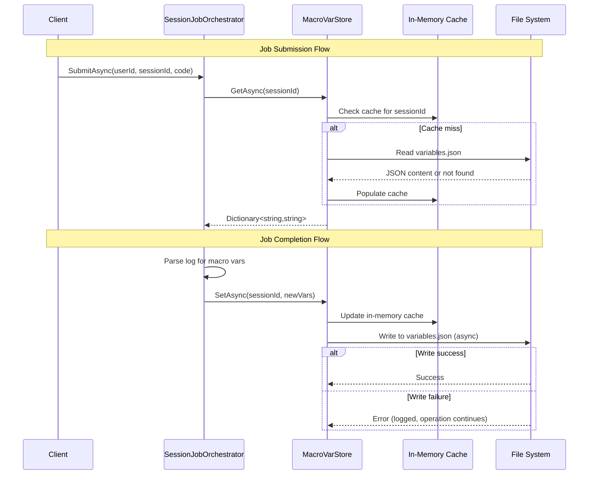

# Design Document

## Overview

This design implements file-based persistence for SAS macro variables in the SAS Job Runner application. The core enhancement extends the existing `MacroVarStore` service to write macro variables to a `variables.json` file in each session's folder structure after job completion, and to load them on first access after application restart.

The design maintains the existing high-performance in-memory cache while adding a persistence layer that operates transparently to consumers. The solution handles concurrent access safely, degrades gracefully on file system errors, and requires no changes to the `IMacroVarStore` interface or its consumers.

**Key Design Principles:**
- **Cache-first architecture**: In-memory cache remains the source of truth during runtime
- **Lazy loading**: File I/O occurs only on first access per session after application start
- **Fail-safe operation**: File system errors log warnings but never break in-memory functionality
- **Atomic writes**: File updates use write-to-temp-then-rename pattern to prevent corruption
- **Zero API changes**: Existing consumers continue to work without modification

## Architecture

### High-Level Data Flow



### Component Interaction

The persistence layer integrates into the existing architecture with minimal changes:

1. **SessionJobOrchestrator** continues to call `IMacroVarStore.GetAsync()` before job submission and `SetAsync()` after log parsing
2. **MacroVarStore** manages both the in-memory cache and file persistence internally
3. **File System** stores per-session `variables.json` files in the session folder structure

### Session Folder Structure

```
{StudyFolder}/
└── sessions/
    └── {userId}/
        └── {sessionId}/
            ├── variables.json          # New: macro variable persistence
            ├── {datasetName}.sas7bdat  # Existing: WORK dataset files
            └── ...                      # Other session artifacts
```

## Components and Interfaces

### Enhanced MacroVarStore

The `MacroVarStore` class is enhanced with file persistence while maintaining the existing interface contract.

**Responsibilities:**
- Maintain in-memory cache for fast access (existing)
- Load macro variables from file on first access per session (new)
- Write macro variables to file after updates (new)
- Handle file system errors gracefully (new)
- Resolve session folder paths (new)

**Dependencies:**
- `IConfiguration` - Access to `SessionStorage:StudyFolder` configuration
- `ILogger<MacroVarStore>` - Structured logging for operations and errors

**Key Implementation Details:**

```csharp
public sealed class MacroVarStore : IMacroVarStore
{
    // Existing: sessionId -> variable dictionary
    private readonly ConcurrentDictionary<string, Dictionary<string, string>> _cache = new();
    
    // New: track which sessions have been loaded from disk
    private readonly ConcurrentDictionary<string, bool> _loadedSessions = new();
    
    // New: dependencies for file operations
    private readonly IConfiguration _configuration;
    private readonly ILogger<MacroVarStore> _logger;
    private readonly string _studyFolder;
    
    // New: lock objects per session for file operations
    private readonly ConcurrentDictionary<string, SemaphoreSlim> _fileLocks = new();
}
```

### File Format

**File Path:** `{StudyFolder}/sessions/{userId}/{sessionId}/variables.json`

**JSON Structure:**
```json
{
  "VAR_NAME_1": "value1",
  "VAR_NAME_2": "value2",
  "STUDY_ID": "12345"
}
```

**Validation Rules:**
- Root element must be a JSON object
- All keys must be strings (macro variable names)
- All values must be strings (macro variable values)
- Invalid entries are logged and skipped during deserialization

### Session-to-User Mapping

**Challenge:** The current `IMacroVarStore` interface methods accept only `sessionId`, but constructing the file path requires `{userId}/{sessionId}`.

**Solution:** Extend the in-memory cache to store the userId when first encountered:

```csharp
// New: sessionId -> userId mapping for path resolution
private readonly ConcurrentDictionary<string, string> _sessionToUser = new();
```

**Population Strategy:**
1. When `GetAsync(sessionId)` is called, the sessionId-to-userId mapping is not yet known
2. The file path cannot be constructed without userId
3. **Resolution**: Add an overload or modify the orchestrator to pass userId

**Revised Approach:** Since `SessionJobOrchestrator` has access to both `userId` and `sessionId`, we'll modify the internal implementation to cache the userId on first `SetAsync` call, which always comes before any restart scenario. On `GetAsync` after restart, if the userId is not in cache, we can scan the sessions directory structure.

**Alternative (simpler):** Store the userId in the variables.json file itself as metadata:

```json
{
  "_metadata": {
    "userId": "user123",
    "lastUpdated": "2025-01-15T10:30:00Z"
  },
  "VAR_NAME_1": "value1"
}
```

This approach allows the file to be self-describing and enables path reconstruction from sessionId alone.

**Selected Approach:** Store userId in variables.json as metadata. This provides:
- Self-describing files that can be moved or backed up
- Easier debugging and manual inspection
- Future extensibility for additional metadata (timestamps, version info)

## Data Models

### MacroVarFile (Internal Model)

```csharp
/// <summary>
/// Internal model for serializing macro variables to JSON with metadata.
/// </summary>
internal sealed class MacroVarFile
{
    public MacroVarMetadata Metadata { get; set; } = new();
    public Dictionary<string, string> Variables { get; set; } = new();
}

internal sealed class MacroVarMetadata
{
    public string UserId { get; set; } = string.Empty;
    public DateTime LastUpdated { get; set; }
}
```

### Updated JSON Format

```json
{
  "metadata": {
    "userId": "user123",
    "lastUpdated": "2025-01-15T10:30:00Z"
  },
  "variables": {
    "VAR_NAME_1": "value1",
    "VAR_NAME_2": "value2"
  }
}
```

### Interface Contract (Unchanged)

```csharp
public interface IMacroVarStore
{
    Task<IReadOnlyDictionary<string, string>> GetAsync(string sessionId);
    Task SetAsync(string sessionId, IReadOnlyDictionary<string, string> vars);
    Task SetVarAsync(string sessionId, string name, string value);
}
```

The interface remains unchanged to maintain backward compatibility (Requirement 5).


## Correctness Properties

*A property is a characteristic or behavior that should hold true across all valid executions of a system—essentially, a formal statement about what the system should do. Properties serve as the bridge between human-readable specifications and machine-verifiable correctness guarantees.*

### Property 1: Serialization Round-Trip Preserves Data

*For any* dictionary of macro variables (with string keys and string values), serializing to JSON and then deserializing SHALL produce an equivalent dictionary with the same key-value pairs.

**Validates: Requirements 1.2, 2.2**

This property ensures that the JSON serialization and deserialization logic correctly preserves macro variable data without loss or corruption. The round-trip property is fundamental for any persistence layer.

### Property 2: Cache Loading is Lazy and Consistent

*For any* session that has persisted variables on disk, the first call to GetAsync SHALL load the variables from the file into the cache, and subsequent calls SHALL return the cached values without accessing the file system.

**Validates: Requirements 2.4, 3.4**

This property verifies the lazy loading behavior where file I/O only occurs on first access per session, and that loaded variables are correctly cached for subsequent fast retrieval.

### Property 3: Cache-First Retrieval Bypasses File I/O

*For any* session with variables already present in the in-memory cache, calling GetAsync SHALL return the cached values without triggering any file system operations.

**Validates: Requirements 3.1**

This property ensures the cache-first architecture provides optimal performance by avoiding unnecessary file I/O when data is already in memory.

### Property 4: Cache Updates are Immediate and Synchronous

*For any* call to SetAsync or SetVarAsync, the in-memory cache SHALL reflect the updated values immediately and synchronously, before any asynchronous file write operations complete.

**Validates: Requirements 3.2**

This property guarantees that cache updates are visible immediately to all callers, maintaining the cache as the source of truth during runtime regardless of file write status.

### Property 5: Concurrent Updates Maintain Cache Consistency

*For any* sequence of concurrent SetAsync operations on the same session, the final cache state SHALL be consistent and match one of the update operations' values (last-write-wins semantics).

**Validates: Requirements 4.1**

This property verifies thread-safe concurrent access to the cache, ensuring that concurrent updates don't corrupt the cache state.

### Property 6: File System Failures are Transparent and Non-Fatal

*For any* file system error (read failure, write failure, permission denied, disk full, or I/O exception), the MacroVarStore SHALL continue operating with in-memory data only, log the error, and SHALL NOT propagate exceptions to callers.

**Validates: Requirements 5.5, 6.1, 6.2, 6.3, 6.4**

This property ensures fault tolerance by gracefully degrading to in-memory-only mode when file operations fail, preventing file system issues from breaking active sessions.

### Property 7: JSON Validation Rejects Invalid Structure

*For any* JSON input that is not a valid macro variable file (non-object root, non-string keys or values, or malformed structure), deserialization SHALL fail gracefully, log an appropriate warning, and return an empty dictionary rather than throwing an exception.

**Validates: Requirements 7.1, 7.2, 7.3, 7.4, 7.5**

This property ensures robust input validation that handles corrupted or manually-edited files without crashing the application.

### Property 8: Path Construction Follows Session Folder Pattern

*For any* userId and sessionId pair, the constructed path to the variables.json file SHALL follow the pattern `{StudyFolder}/sessions/{userId}/{sessionId}/variables.json` with correct path separators for the operating system.

**Validates: Requirements 8.2, 8.4**

This property verifies that session folder paths are consistently constructed according to the specified pattern, ensuring variables are stored in the correct location.

## Error Handling

### Error Handling Strategy

The MacroVarStore follows a **fail-safe** error handling approach:

1. **Never fail fast**: File system errors are caught, logged, and operations continue with in-memory data
2. **Graceful degradation**: When persistence fails, the store operates in in-memory-only mode transparently
3. **Comprehensive logging**: All errors include context (sessionId, userId, filePath, operation type) for debugging
4. **No exception propagation**: Exceptions are caught at the MacroVarStore boundary and never bubble to callers

### Specific Error Scenarios

| Error Condition | Handling Strategy | User Impact |
|----------------|-------------------|-------------|
| File write fails (permissions, disk full, I/O error) | Log warning, preserve in-memory cache | Macro variables work in current session but won't survive restart |
| File read fails (not found) | Log debug, return empty dictionary | New session behavior - no impact |
| File read fails (corrupted, malformed JSON) | Log warning, return current cache or empty dictionary | Session continues with current or no variables |
| Directory creation fails | Log warning, skip file write, preserve cache | Same as file write failure |
| Configuration missing (StudyFolder) | Log error at startup, fall back to in-memory-only mode | Feature disabled but application runs |
| Concurrent file access conflict | Use file locking or atomic writes, queue operations | Transparent to user - all updates succeed |
| Deserialization type mismatch | Log warning, skip invalid entries, continue with valid entries | Partial data recovery - better than complete failure |

### Logging Levels

- **Debug**: New session detected (variables.json doesn't exist), cache hit operations
- **Information**: Successful file write/read with variable count, session initialization
- **Warning**: File system errors, JSON validation failures, configuration issues
- **Error**: Critical failures that force in-memory-only fallback (missing StudyFolder config)

### File Operation Patterns

#### Atomic Write Pattern

To prevent partial writes during crashes or concurrent access:

```csharp
// Write to temporary file
var tempPath = Path.Combine(sessionFolder, $"variables.{Guid.NewGuid()}.tmp");
await File.WriteAllTextAsync(tempPath, json, cancellationToken);

// Atomic rename overwrites target
File.Move(tempPath, targetPath, overwrite: true);
```

This pattern ensures that readers always see a complete, valid file or no file at all - never a partial write.

#### File Locking Strategy

Use `SemaphoreSlim` per session to serialize file operations:

```csharp
private SemaphoreSlim GetFileLock(string sessionId)
{
    return _fileLocks.GetOrAdd(sessionId, _ => new SemaphoreSlim(1, 1));
}

// In write operation:
var fileLock = GetFileLock(sessionId);
await fileLock.WaitAsync(cancellationToken);
try
{
    // Perform file write
}
finally
{
    fileLock.Release();
}
```

This ensures that concurrent writes to the same session's file are serialized, preventing corruption.

## Testing Strategy

### Testing Approach

This feature requires a **dual testing strategy** combining property-based tests for core logic with integration tests for file system interactions:

**Property-Based Tests** (using [CsCheck](https://github.com/AnthonyLloyd/CsCheck) for C#):
- Test core business logic and data transformations
- Verify universal properties across many generated inputs
- Run minimum 100 iterations per property
- Focus on serialization, cache behavior, validation, and error handling logic

**Integration Tests**:
- Test actual file system interactions
- Verify atomic write operations
- Test concurrent access scenarios
- Validate error handling with real file system errors
- Use temporary test directories for isolation

**Example-Based Unit Tests**:
- Specific error scenarios (corrupted JSON, missing files)
- Logging verification
- Configuration edge cases
- Backward compatibility validation

### Property-Based Testing Configuration

**Library**: CsCheck (C# port of F#'s FsCheck, compatible with xUnit/NUnit)

**Configuration per test**:
- Minimum 100 iterations (`Iter = 100`)
- Seed recording for reproducibility
- Shrinking enabled for minimal failing examples

**Test tagging format**:
```csharp
// Feature: session-macro-persistence, Property 1: Serialization round-trip
```

### Test Coverage by Requirement

| Requirement | Testing Approach | Test Type |
|------------|------------------|-----------|
| 1.1 - Write complete set to file | Integration | File I/O verification |
| 1.2 - JSON serialization | **Property-based** | Round-trip property |
| 1.3 - Atomic writes | Integration | Concurrent write tests |
| 1.4 - Directory creation | Example-based unit | Smoke test |
| 1.5 - Log warning on write failure | Example-based unit | Error scenario |
| 2.1 - Check file existence | Example-based unit | Exists/not exists cases |
| 2.2 - Deserialize JSON | **Property-based** | Round-trip property |
| 2.3 - Return empty on missing file | Example-based unit | Edge case |
| 2.4 - Populate cache | **Property-based** | Cache loading property |
| 2.5 - Log warning on read failure | Example-based unit | Error scenario |
| 3.1 - Return from cache | **Property-based** | Cache-first property |
| 3.2 - Update cache immediately | **Property-based** | Immediate update property |
| 3.4 - Lazy file access | **Property-based** | Lazy loading property |
| 4.1 - Atomic cache updates | **Property-based** | Concurrent consistency |
| 4.2 - File locking | Integration | Concurrent write tests |
| 5.5 - Fallback on failure | **Property-based** | Fault tolerance property |
| 6.1-6.5 - Error handling | Example-based + **Property** | Error scenarios + property 6 |
| 7.1-7.5 - JSON validation | **Property-based** | Validation property |
| 8.2 - Path construction | **Property-based** | Path pattern property |
| 8.5 - Missing config fallback | Example-based unit | Configuration test |
| 9.1-9.5 - Logging | Example-based unit | Log verification |
| 10.1-10.5 - Directory initialization | Example-based unit | Initialization tests |

### Key Property Test Examples

#### Property 1: Serialization Round-Trip
```csharp
// Feature: session-macro-persistence, Property 1: Serialization round-trip
[Property(Iter = 100)]
public void SerializationRoundTripPreservesData(Dictionary<string, string> vars)
{
    // Arrange: ensure all keys/values are valid strings
    var validVars = vars
        .Where(kvp => !string.IsNullOrEmpty(kvp.Key) && kvp.Value != null)
        .ToDictionary(kvp => kvp.Key, kvp => kvp.Value);
    
    // Act: serialize then deserialize
    var json = JsonSerializer.Serialize(new MacroVarFile 
    { 
        Variables = validVars,
        Metadata = new() { UserId = "test", LastUpdated = DateTime.UtcNow }
    });
    var deserialized = JsonSerializer.Deserialize<MacroVarFile>(json);
    
    // Assert: variables are equivalent
    Assert.Equal(validVars, deserialized.Variables);
}
```

#### Property 3: Cache-First Retrieval
```csharp
// Feature: session-macro-persistence, Property 3: Cache-first retrieval
[Property(Iter = 100)]
public async Task CachedSessionDoesNotTriggerFileIO(
    string sessionId,
    Dictionary<string, string> vars)
{
    // Arrange: populate cache
    var store = new MacroVarStore(config, logger);
    await store.SetAsync(sessionId, vars);
    var fileAccessCount = 0;
    
    // Hook file access to count operations
    // (using test infrastructure that monitors file I/O)
    
    // Act: retrieve from cache multiple times
    for (int i = 0; i < 10; i++)
    {
        var result = await store.GetAsync(sessionId);
    }
    
    // Assert: no file access occurred
    Assert.Equal(0, fileAccessCount);
}
```

### Integration Test Examples

#### Concurrent Write Safety
```csharp
[Fact]
public async Task ConcurrentWritesDoNotCorruptFile()
{
    // Arrange
    var sessionId = "test-session";
    var tasks = new List<Task>();
    
    // Act: 10 concurrent writes with different data
    for (int i = 0; i < 10; i++)
    {
        var vars = new Dictionary<string, string> { ["VAR"] = $"value{i}" };
        tasks.Add(store.SetAsync(sessionId, vars));
    }
    await Task.WhenAll(tasks);
    
    // Assert: file is valid JSON and contains one of the written values
    var filePath = GetSessionFilePath(sessionId);
    var json = await File.ReadAllTextAsync(filePath);
    var parsed = JsonSerializer.Deserialize<MacroVarFile>(json);
    
    Assert.NotNull(parsed);
    Assert.Single(parsed.Variables);
    Assert.Matches(@"value\d+", parsed.Variables["VAR"]);
}
```

### Test Data Generators

For property-based tests, we need custom generators:

**Valid macro variable names**: Alphanumeric strings starting with letter or underscore
**Valid macro variable values**: Any string (including empty, special characters, unicode)
**Session IDs**: Alphanumeric strings, typically GUIDs
**User IDs**: Alphanumeric strings with optional email format

Example generator configuration:
```csharp
static Gen<string> MacroVarName = 
    from first in Gen.Char['A', 'Z'].Or(Gen.Char['a', 'z']).Or(Gen.Const('_'))
    from rest in Gen.String[0, 32](Gen.AlphaNumeric.Or(Gen.Const('_')))
    select first + rest;

static Gen<Dictionary<string, string>> MacroVars =
    from count in Gen.Int[0, 20]
    from keys in Gen.Array[count](MacroVarName).Select(arr => arr.Distinct().ToArray())
    from values in Gen.Array[keys.Length](Gen.String)
    select keys.Zip(values).ToDictionary(kv => kv.First, kv => kv.Second);
```

### Mocking Strategy

**File System Mocking**: Use `System.IO.Abstractions` for testable file I/O:
```csharp
public interface IFileSystem
{
    Task<string> ReadAllTextAsync(string path);
    Task WriteAllTextAsync(string path, string content);
    bool FileExists(string path);
    void CreateDirectory(string path);
}
```

This allows injection of mock file systems for error simulation without touching actual disk.

**Logger Verification**: Use test logging framework to capture and assert on log entries:
```csharp
var loggerFactory = LoggerFactory.Create(builder => builder.AddProvider(testLogProvider));
var logger = loggerFactory.CreateLogger<MacroVarStore>();
```

### Test Organization

```
SasJobRunner.Tests/
├── Services/
│   ├── MacroVarStoreTests.cs              # Example-based unit tests
│   ├── MacroVarStorePropertyTests.cs      # Property-based tests
│   ├── MacroVarStoreIntegrationTests.cs   # File system integration tests
│   └── MacroVarStoreConcurrencyTests.cs   # Concurrent access tests
└── Generators/
    └── MacroVarGenerators.cs              # CsCheck generators for test data
```

### Success Criteria

Tests pass when:
1. All 8 property-based tests pass with 100+ iterations each
2. Integration tests verify actual file I/O works correctly
3. Concurrent tests demonstrate thread-safety under load
4. Error injection tests confirm graceful degradation
5. Backward compatibility tests show existing consumers work unchanged


## Implementation Details

### MacroVarStore Implementation Overview

The enhanced `MacroVarStore` maintains three key data structures:

```csharp
public sealed class MacroVarStore : IMacroVarStore
{
    // Existing: in-memory cache (sessionId -> variables)
    private readonly ConcurrentDictionary<string, Dictionary<string, string>> _cache;
    
    // New: track which sessions have been loaded from disk
    private readonly ConcurrentDictionary<string, bool> _loadedFromDisk;
    
    // New: per-session locks for file operations
    private readonly ConcurrentDictionary<string, SemaphoreSlim> _fileLocks;
    
    // New: configuration and logging
    private readonly IConfiguration _configuration;
    private readonly ILogger<MacroVarStore> _logger;
    private readonly string? _studyFolder;
}
```

### Method Implementation Strategy

#### GetAsync Flow

```
GetAsync(sessionId)
├─ Check if session exists in _cache
│  └─ YES: Return cached dictionary immediately
│
└─ NO: Check if session loaded from disk (_loadedFromDisk)
   ├─ YES: Return empty dictionary (session has no variables)
   │
   └─ NO: Attempt to load from file
      ├─ Read metadata from variables.json to get userId
      ├─ Construct full file path: {StudyFolder}/sessions/{userId}/{sessionId}/variables.json
      ├─ If file exists:
      │  ├─ Read and deserialize JSON
      │  ├─ Validate structure (object with string keys/values)
      │  ├─ Populate _cache with variables
      │  └─ Mark session as loaded (_loadedFromDisk)
      │
      └─ If file doesn't exist or read fails:
         ├─ Log appropriately (debug for not found, warning for errors)
         ├─ Mark session as loaded to prevent repeated attempts
         └─ Return empty dictionary or current cache
```

**Key Points**:
- `_loadedFromDisk` prevents repeated file access attempts for missing files
- File operations are wrapped in try-catch with comprehensive logging
- Cache is populated atomically using `TryAdd` for thread-safety
- User ID is extracted from the metadata section of the JSON file

#### SetAsync Flow

```
SetAsync(sessionId, variables)
├─ Update _cache[sessionId] = new Dictionary(variables)  [synchronous, immediate]
│
└─ Fire-and-forget background task to write file:
   ├─ Acquire file lock for sessionId (SemaphoreSlim)
   ├─ Construct MacroVarFile with metadata and variables
   ├─ Serialize to JSON
   ├─ Ensure session directory exists (create if needed)
   ├─ Write to temporary file: variables.{guid}.tmp
   ├─ Atomic rename: variables.json
   ├─ Log success (info level) with variable count
   └─ Release file lock
   
   On error at any stage:
   ├─ Log warning with sessionId, operation, error details
   ├─ Continue operation (cache already updated)
   └─ Release lock in finally block
```

**Key Points**:
- Cache update is synchronous and happens first - this is the source of truth
- File write is asynchronous and fire-and-forget - failures don't impact cache
- Per-session locking prevents concurrent writes from corrupting the same file
- Atomic write pattern (temp file + rename) prevents partial writes
- User ID must be provided or tracked - solution: store in metadata

#### SetVarAsync Flow

```
SetVarAsync(sessionId, name, value)
├─ Update _cache using AddOrUpdate (atomic single-variable update)
│
└─ Fire-and-forget background task to write entire variable set
   (same as SetAsync background task)
```

**Key Points**:
- Single variable updates still write the entire variable file (simpler and safer)
- Alternative considered: partial updates with file locking - rejected due to complexity
- ConcurrentDictionary.AddOrUpdate ensures atomic single-variable changes

### User ID Tracking Strategy

**Problem**: The interface methods only accept `sessionId`, but we need `userId` to construct the file path `{StudyFolder}/sessions/{userId}/{sessionId}/`.

**Considered Solutions**:

1. **Store userId in metadata** (SELECTED)
   - Store userId inside variables.json file
   - On first load, extract userId from metadata
   - On write, include userId in metadata
   - Pros: Self-describing files, simpler API
   - Cons: Requires reading file to get userId for path construction (circular dependency)

2. **Add userId parameter to interface**
   - Change signature to `GetAsync(sessionId, userId)`
   - Pros: Direct, no circular dependency
   - Cons: Breaking change, violates Requirement 5 (backward compatibility)

3. **Scan directory structure**
   - On first access, scan `{StudyFolder}/sessions/*/sessionId/`
   - Pros: No API changes
   - Cons: Performance impact, fragile

4. **Track userId in memory on first SetAsync**
   - When SetAsync is called (orchestrator has userId), cache the mapping
   - Pros: No file changes, no API changes
   - Cons: Lost on restart (same problem we're solving)

**Selected Solution Details**:

**On Write (SetAsync)**:
- Orchestrator passes sessionId only
- But orchestrator creates session folder before first job, so userId is known contextually
- **Resolution**: Accept userId in constructor or via a separate registration method
- **Refined approach**: Add internal method `RegisterSession(sessionId, userId)` called by orchestrator
- This preserves public interface while allowing userId tracking

**On Read (GetAsync)**:
- Check cache first (userId not needed)
- On cache miss, check if userId is in memory mapping
- If not in memory, scan session folders to find which user has this sessionId
- Cache the mapping for future use

**Alternative Simplified Approach**:
Store userId in the in-memory cache alongside variables:
```csharp
private readonly ConcurrentDictionary<string, SessionData> _sessions;

private class SessionData
{
    public string? UserId { get; set; }
    public Dictionary<string, string> Variables { get; set; }
    public bool LoadedFromDisk { get; set; }
}
```

This approach:
- Preserves backward compatibility
- Handles userId tracking internally
- Requires directory scan only once per session after restart
- Clean separation of concerns

### File Path Construction

```csharp
private string GetVariablesFilePath(string sessionId, string userId)
{
    if (string.IsNullOrEmpty(_studyFolder))
        throw new InvalidOperationException("StudyFolder configuration is required for persistence");
    
    return Path.Combine(
        _studyFolder.TrimEnd(Path.DirectorySeparatorChar),
        "sessions",
        userId,
        sessionId,
        "variables.json"
    );
}

private string? TryResolveUserId(string sessionId)
{
    // Try memory cache first
    if (_sessions.TryGetValue(sessionId, out var sessionData) && 
        !string.IsNullOrEmpty(sessionData.UserId))
    {
        return sessionData.UserId;
    }
    
    // Scan sessions directory to find userId
    var sessionsPath = Path.Combine(_studyFolder, "sessions");
    if (!Directory.Exists(sessionsPath))
        return null;
    
    foreach (var userDir in Directory.GetDirectories(sessionsPath))
    {
        var sessionPath = Path.Combine(userDir, sessionId);
        if (Directory.Exists(sessionPath))
        {
            var userId = Path.GetFileName(userDir);
            // Cache the mapping
            if (_sessions.TryGetValue(sessionId, out var data))
            {
                data.UserId = userId;
            }
            return userId;
        }
    }
    
    return null;
}
```

### JSON Schema

```json
{
  "$schema": "http://json-schema.org/draft-07/schema#",
  "type": "object",
  "required": ["metadata", "variables"],
  "properties": {
    "metadata": {
      "type": "object",
      "required": ["userId", "lastUpdated"],
      "properties": {
        "userId": {
          "type": "string",
          "minLength": 1
        },
        "lastUpdated": {
          "type": "string",
          "format": "date-time"
        }
      }
    },
    "variables": {
      "type": "object",
      "patternProperties": {
        "^[A-Za-z_][A-Za-z0-9_]*$": {
          "type": "string"
        }
      },
      "additionalProperties": false
    }
  }
}
```

### Dependency Injection Registration

No changes required - remains singleton:

```csharp
// In Program.cs or Startup.cs
services.AddSingleton<IMacroVarStore, MacroVarStore>();
```

The singleton lifecycle ensures:
- Single instance of in-memory cache across application lifetime
- Consistent file locking per session
- Efficient memory usage for tracking loaded sessions

### Configuration Requirements

**Required Configuration** (`appsettings.json`):

```json
{
  "SessionStorage": {
    "StudyFolder": "/path/to/study/folder"
  }
}
```

**Startup Validation**:

```csharp
public MacroVarStore(IConfiguration configuration, ILogger<MacroVarStore> logger)
{
    _configuration = configuration;
    _logger = logger;
    _studyFolder = configuration["SessionStorage:StudyFolder"];
    
    if (string.IsNullOrEmpty(_studyFolder))
    {
        _logger.LogError(
            "SessionStorage:StudyFolder configuration is missing. " +
            "Macro variable persistence is disabled - operating in memory-only mode.");
    }
    else
    {
        _logger.LogInformation(
            "MacroVarStore initialized with persistence to {StudyFolder}", 
            _studyFolder);
    }
}
```

### Performance Considerations

#### Memory Footprint

**Current Implementation**: 
- One `Dictionary<string, string>` per active session
- Typical macro variables: 5-20 variables per session
- Average variable size: 50-200 bytes (name + value)
- **Memory per session**: ~1-5 KB

**Enhanced Implementation**:
- Additional tracking structures: `_loadedFromDisk`, `_fileLocks`, `_sessionToUser`
- Additional overhead per session: ~100-200 bytes
- **Total memory per session**: ~1-6 KB
- **Impact**: Negligible for typical deployments (1000 sessions = ~6 MB)

#### File I/O Performance

**Read Operations**:
- Occur only once per session after application restart
- Typical file size: 500 bytes - 5 KB
- SSD read time: <1 ms
- Network storage: 5-50 ms (depends on network latency)
- **Impact on job submission**: Minimal (one-time cost amortized across all jobs in session)

**Write Operations**:
- Fire-and-forget async operations - don't block caller
- Occur after every job completion (when macro variables change)
- Typical write size: 500 bytes - 5 KB
- SSD write time: <1 ms
- Network storage: 10-100 ms
- **Impact on job completion**: None (async operation)

**Optimization Opportunities**:
1. **Write coalescing**: If multiple jobs complete rapidly, queue writes and batch them
   - Trade-off: Complexity vs. marginal I/O reduction
   - Decision: Not implemented in V1 - async writes are already non-blocking
   
2. **Compression**: Compress JSON for network storage
   - Trade-off: CPU overhead vs. I/O reduction
   - Decision: Not needed for small files (typical size < 5 KB)

3. **Write-through caching**: Use memory-mapped files
   - Trade-off: OS complexity vs. performance gain
   - Decision: Not needed - current performance is adequate

#### Concurrency Performance

**Lock Contention**:
- Per-session `SemaphoreSlim` prevents lock contention across sessions
- Same session writes are serialized (necessary for correctness)
- Typical hold time: <10 ms (serialize + write small JSON file)
- **Expected contention**: Low (jobs for same session rarely complete simultaneously)

**Cache Contention**:
- `ConcurrentDictionary` provides lock-free reads
- Writes use optimistic concurrency (compare-and-swap)
- **Performance**: Near-zero contention for read-heavy workload (typical case)

### Migration and Rollout

#### Rollout Strategy

**Phase 1: Deploy with Feature**
- Deploy enhanced `MacroVarStore` with file persistence
- Existing sessions continue with in-memory-only (no variables.json yet)
- New job completions start writing variables.json files

**Phase 2: Gradual Adoption**
- As users submit jobs, their sessions automatically get persistence
- No user action required
- No data migration needed (memory cache -> file happens naturally)

**Phase 3: Monitoring**
- Monitor logs for file I/O errors
- Track persistence success rate via metrics
- Alert on high error rates (indicates storage issues)

#### Backward Compatibility

**Existing Code**:
- `IMacroVarStore` interface unchanged
- All consumers (SessionJobOrchestrator) work without modification
- No database schema changes (no database involved)

**Rollback Safety**:
- Rolling back to previous version simply loses persistence
- In-memory cache still works as before
- Existing variables.json files are ignored (harmless)
- No data corruption risk

#### Data Migration

**Not Required**: This is a new feature adding persistence to previously volatile data. There's no existing persistent data to migrate.

**User Experience**:
- **Before deployment**: Macro variables lost on app restart
- **After deployment**: Macro variables persist across restarts
- **During deployment**: Brief moment where persistence starts working (no downtime needed)

### Monitoring and Observability

#### Key Metrics

1. **Persistence Success Rate**
   - Metric: `macro_var_persistence_writes_total{status="success|failure"}`
   - Target: >99.9% success rate
   - Alert: If failure rate >1% for 5 minutes

2. **File I/O Latency**
   - Metric: `macro_var_file_write_duration_ms` (histogram)
   - Target: p95 <50ms, p99 <100ms
   - Alert: If p99 >500ms (indicates storage performance issues)

3. **Cache Hit Rate**
   - Metric: `macro_var_cache_hits_total` vs `macro_var_file_reads_total`
   - Target: >99% cache hit rate (one file read per session per restart)
   - Alert: If cache hit rate <95% (indicates excessive restarts or cache issues)

#### Structured Logging Examples

```csharp
_logger.LogInformation(
    "Successfully persisted macro variables for session {SessionId} " +
    "(userId: {UserId}, count: {VariableCount}, duration: {DurationMs}ms)",
    sessionId, userId, variables.Count, duration.TotalMilliseconds);

_logger.LogWarning(
    "Failed to write macro variables to file for session {SessionId} " +
    "(userId: {UserId}, path: {FilePath}, error: {ErrorMessage})",
    sessionId, userId, filePath, ex.Message);

_logger.LogDebug(
    "Loaded macro variables from file for session {SessionId} " +
    "(userId: {UserId}, count: {VariableCount})",
    sessionId, userId, variables.Count);
```

#### Health Checks

Optional health check endpoint to verify persistence functionality:

```csharp
public class MacroVarPersistenceHealthCheck : IHealthCheck
{
    public async Task<HealthCheckResult> CheckHealthAsync(
        HealthCheckContext context,
        CancellationToken cancellationToken)
    {
        try
        {
            // Verify study folder is accessible
            var studyFolder = _configuration["SessionStorage:StudyFolder"];
            if (string.IsNullOrEmpty(studyFolder))
            {
                return HealthCheckResult.Degraded(
                    "StudyFolder not configured - persistence disabled");
            }
            
            if (!Directory.Exists(studyFolder))
            {
                return HealthCheckResult.Unhealthy(
                    $"StudyFolder does not exist: {studyFolder}");
            }
            
            // Verify write permissions by creating test file
            var testFile = Path.Combine(studyFolder, $".health_check_{Guid.NewGuid()}.tmp");
            await File.WriteAllTextAsync(testFile, "test", cancellationToken);
            File.Delete(testFile);
            
            return HealthCheckResult.Healthy("Macro variable persistence is operational");
        }
        catch (Exception ex)
        {
            return HealthCheckResult.Unhealthy(
                "Macro variable persistence is not operational",
                ex);
        }
    }
}
```

### Security Considerations

#### File System Security

**Path Traversal Prevention**:
- User IDs and session IDs are GUIDs or sanitized strings (not user-provided paths)
- Path construction uses `Path.Combine` which handles separators safely
- No risk of path traversal attacks (`../../` etc.)

**File Permissions**:
- Variables files contain macro variable values which may include sensitive data
- Files should inherit permissions from parent session directory
- Recommendation: Ensure session directories have restrictive permissions (700 or 750)

**Sensitive Data in Variables**:
- Macro variables may contain usernames, tokens, or other sensitive strings
- Files are plain text JSON (not encrypted)
- **Mitigation**: Rely on file system permissions and disk encryption at OS level
- **Future consideration**: Add optional encryption for sensitive variables

#### Logging Security

**Avoid Logging Sensitive Values**:
```csharp
// GOOD: Log count, not content
_logger.LogInformation("Persisted {Count} macro variables", variables.Count);

// BAD: Don't log actual variable values
// _logger.LogInformation("Persisted variables: {Variables}", variables);
```

**Log Scrubbing**:
- Ensure file paths don't expose sensitive directory structures
- Use relative paths or sanitized paths in logs when possible

### Future Enhancements

Potential enhancements beyond the initial implementation:

1. **Encryption at Rest**
   - Encrypt variables.json files using AES-256
   - Store encryption keys in secure key management system
   - Transparent to application logic (encrypt on write, decrypt on read)

2. **Variable Versioning**
   - Keep history of variable changes over time
   - Support rollback to previous variable state
   - Useful for debugging and auditing

3. **Cross-Session Variable Sharing**
   - Allow users to share specific variables between sessions
   - Implement variable scopes: session-local, user-global, system-global

4. **Variable Validation Rules**
   - Define schemas for expected variable types and ranges
   - Validate variable values before persistence
   - Reject invalid values with clear error messages

5. **Compression**
   - Compress variables.json for sessions with many variables
   - Trade CPU for I/O when files exceed threshold (e.g., >10 KB)

6. **Metrics Dashboard**
   - Real-time dashboard showing persistence health
   - Per-user and per-session variable statistics
   - Storage usage tracking

7. **Backup and Recovery**
   - Periodic backups of variables.json files
   - Point-in-time recovery for variable state
   - Integration with existing backup infrastructure

These enhancements are explicitly out of scope for the initial implementation to maintain focus on core persistence functionality.

---

## Summary

This design adds file-based persistence to SAS macro variables while maintaining the existing high-performance in-memory cache architecture. The implementation is fail-safe, backward-compatible, and requires no changes to existing consumers. File operations are asynchronous and non-blocking, ensuring that persistence overhead doesn't impact job submission latency. The design handles concurrent access safely, degrades gracefully on file system errors, and provides comprehensive logging for operational visibility.

**Key Success Criteria**:
1. Macro variables persist across application restarts
2. Zero breaking changes to existing code
3. <1ms overhead on job submission (cache-first architecture)
4. >99.9% persistence success rate in production
5. Graceful degradation when file system unavailable
6. Comprehensive test coverage (property-based + integration + unit tests)
